# Ocean Thrills - Mauritius

[View the live site here](https://carlabuongiorno.github.io/OceanThrills/)

Ocean Thrills is an interactive website incorporating various technological elements to offer users a tool to discover and explore different water activities in Mauritius. It offers a _Google Map_ for each of the activities with _markers_ pinned at the various locations that are best to enjoy that particular activity. Each marker can be _clicked_ and _information_ about that location with regard to the relevant activity is then displayed in a _window_ above the clicked marker on the map.

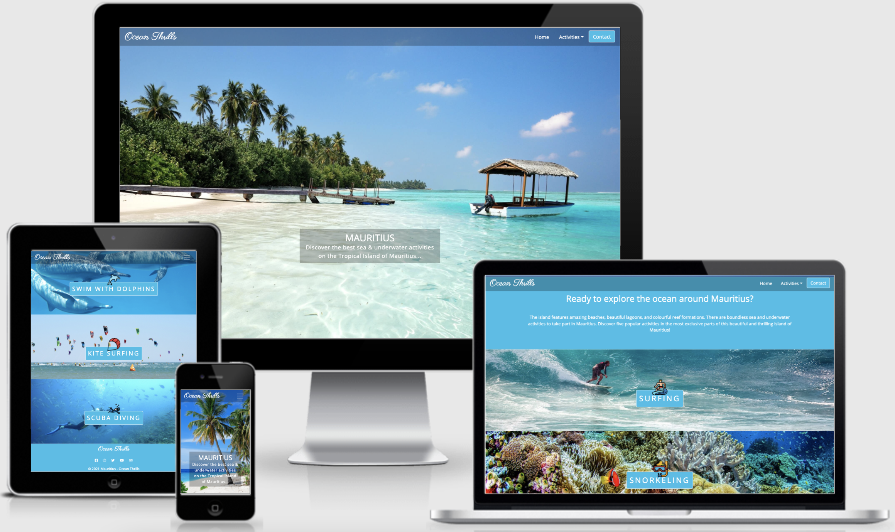

## 2. UXD – User Experience Design
The target demographic are users who are holiday makers in Mauritius, as well as locals, looking to enjoy themselves with some extra sea and underwater activities.

#### Visitor Goals
Visitors to this website are searching for things to do on the island of Mauritius, in particular, water and undersea activities. They wish to locate these activities on a Google Map, and find some of the best locations to enjoy them. Visitors wish to learn more about the locations that the activities are situated, in respect of that activity. They wish to do this easily in an interactive, exciting and thrilling manner, anticipating the adventures to come.

#### Project Goals
Ocean Thrills is the best way to help users achieve their goals because it is easy to navigate, whether by mobile, tablet, or desktop. The navigation bar is always in the viewport no matter where in the site the user has navigated to.

The site is designed so that upon entering, the user immediately anticipates a sense of adventure and fun, and feels impelled to interact with the site.

Ocean Thrills provides an effective, easy to use site for adventurers in Mauritius to explore the sea and underwater activities that are available around the island.

In return for this investment, the site owner would make use of this website, have a professional looking first step into the world of using JavaScript, jQuery and APIs, and an exciting and thrilling project to make a part of her portfolio.

#### User Stories
##### Website Visitor
1. As a site visitor, I wish to navigate through the site easily, so I can quickly find what I am looking for.
2. As a site visitor, I wish to view and interact with the site on all my devices.
3. As a site visitor, I wish to discover what sea and underwater activities I can take part in in Mauritius.
4. As a site visitor, I wish to know more about these activities in Mauritius.
5. As a site visitor, I wish to find the best locations within Mauritius in order to take part in these water activities.
6. As a site visitor, I wish to know more about these locations, either through images, possible linked external websites, or just general information.
7. As a site visitor, I wish to have visible access to social media, so I can follow and be a part of the community.
8. As a site visitor, I wish to be able to get in touch with the site owner and possibly receive discounted offers on the activities.

##### Website Owner
1. As a site owner, this website is aimed at providing Mauritians and holiday makers with useful information about where they can go to take part in five of the many sea and underwater activities available in Mauritius.
2. As the site owner, I wish to be a user of the site when I visit Mauritius.

### Wireframes
- [Wireframes:](assets/images/readme-images/wireframes/desktop-tablet.png) Desktop and tablet version.
- [Wireframes:](assets/images/readme-images/wireframes/small-screen.png) Small screen version. 

### Wireframe and Final Project Differences
- It was decided that the __current weather__ would remain a future feature of the site. This allowed increased focus on the functionality of the site overall.
- It was decided that the __side panel__ would be left out of the project completely. The __information window__ of each marker has ample information and having the __side panel__ could create cognitive overload in the user.

### Design Choices
#### Colours
I decided to go with blue and white as the main colours of this website. These two colours are most associated with nautical decorating. Many holiday homes are decorated using blue and white.

Blue is the colour of the sky on a sunny day, and the colour of the ocean. White is the contrast colour of the light and fluffy clouds in the sky, and the foam that the ocean waves have created.  

In using these colours for my design, it is my intention to evoke happy, holiday emotions in the site visitor.

#### Typography
I selected 2 different fonts for this site: 

1. "Parisienne", (cursive) - For the logo.
2. "Open Sans", (sans-serif) - For the main content for contrast and ease of reading.

#### Icons
Icons were chosen for their obvious meaning and bring a sense of fun and adventure to the user.

#### Images
The images I selected are packed with adventure and beauty. The intention is to bring a typical 'holiday island vibe' to the site. 

## 3. Features
### Existing Features
- The ability to __navigate__ easily through the site:-
    - There is a navigation bar at the top of the page at all times.

        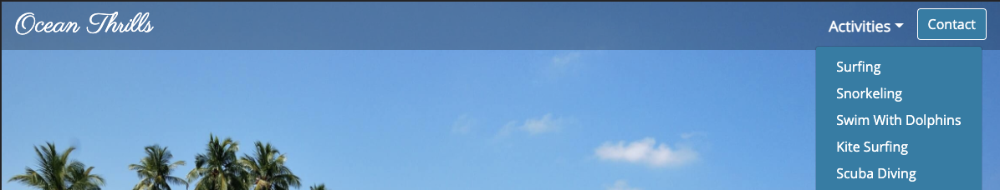

    - The logo __Ocean Thrills__ acts as a link that will always bring the user back to the __Home__ page. The logo in the footer also brings the user back _Home_ from any page if clicked.

        

    - Each activity can be accessed either by the _Activities_ dropdown menu on the navigation bar,

        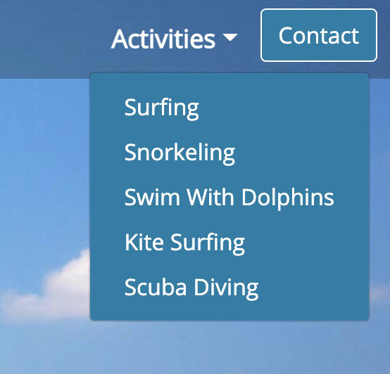 
    
        or by scrolling down the _Home_ page and clicking on the activity of choice.

    The activities include:-
    1. Surfing
    2. Snorkeling
    3. Swim With Dolphins
    4. Kite Surfing
    5. Scuba Diving

        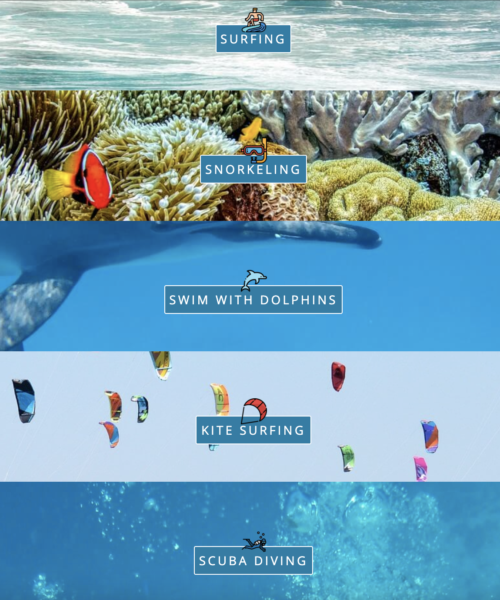

    - The _Contact_ button is also on the navigation bar and takes the user straight to the __Contact__ page.

        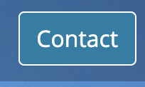

- A footer with a _copyright_, _social media links_, as well as the __Ocean Thrills__ logo.

    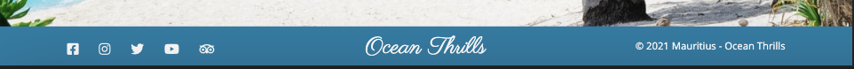

- A __Contact__ page where users can enter their name, email address, a message, as well as 'check' a _checkbox_ giving them the option to receive discounted offers on the Activities listed on the website.

    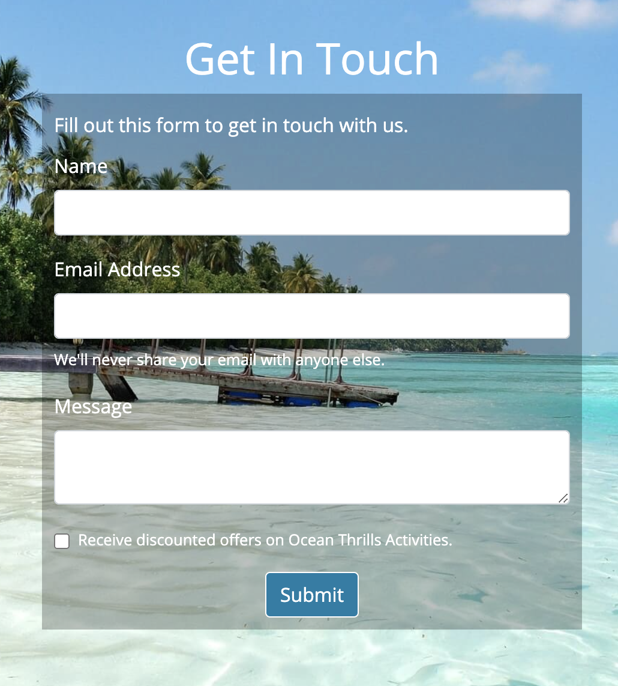

- On submitting the contact form, the site owner receives an email through __EmailJS__ with the user's details and message.

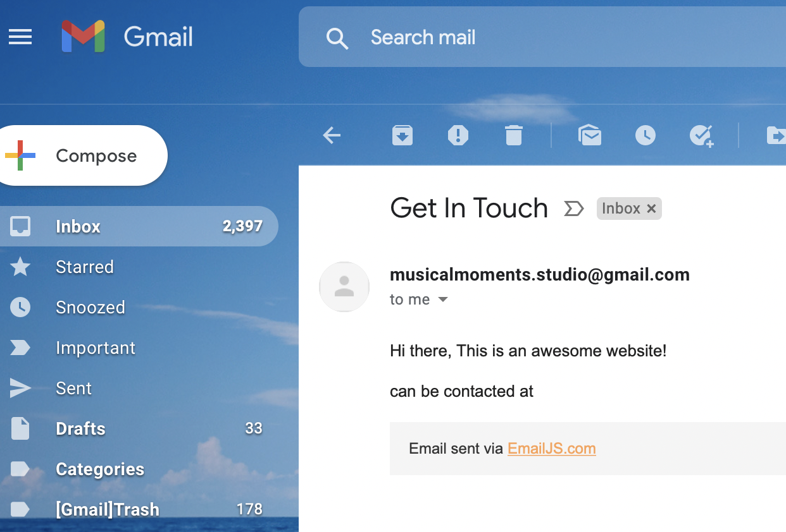

- The site then displays a message to the user based on whether or not the form submission was successful.

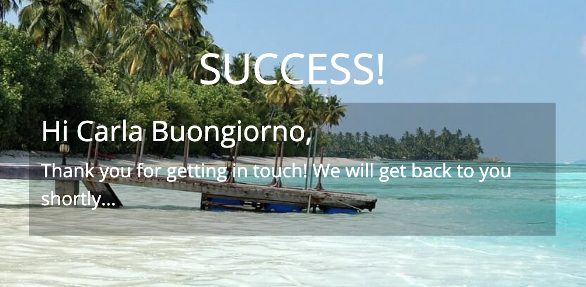

- Each activity features:-

    - A __button group__ with icons relating to each activity in order to navigate directly to another activity page.

        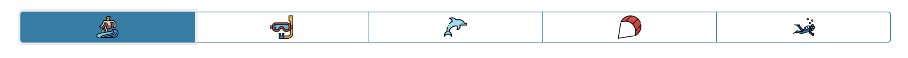

    - An __image__ and __description__ of each activity (Image is not displayed on large screen sizes).
    
        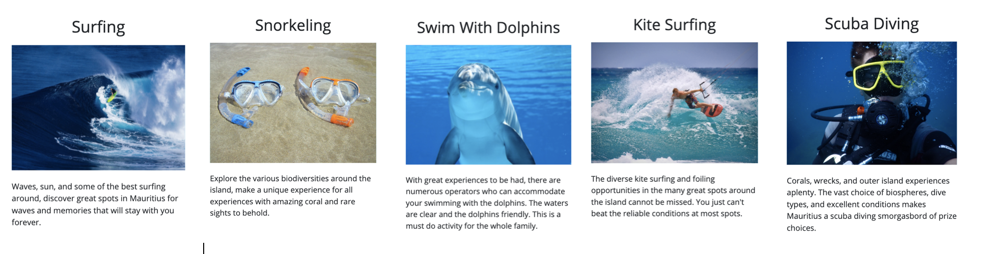

    - A __Google Map__ of Mauritius with __markers__ to show where the best locations are in order to experience the activity.

        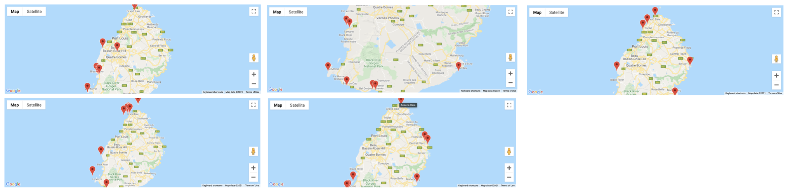

    - The __markers__ also feature an __information window__ that display an image and some information about that location. 

        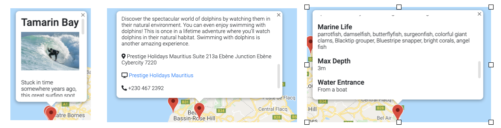

### Features Left to Implement
- A 404 page to help the user navigate back home.

- On medium screen devices and larger, the __current weather__ for Mauritius, displayed in the middle of the navigation bar at all times.

- On small screen divices, the __current weather__ for Mauritius displayed next to the title of each activity page.

- I originally had the maps a little more zoomed in which was great for large screens, but it was then too zoomed in on smaller screens, so in order for the maps to display best on small screen, I zoomed them out and so they are now a lot smaller on larger screen sizes. 
I'm sure there is a way to make the maps more responsive to different screen sizes, but I have decided to leave that task as a future feature due to time constraints.

- __Marker Clustering__ would be a great way to get around the fact that there are so many markers on each map and a user cannot access them easily while they are so close together. Due to time constraints, I leave this as a future feature.

- __User feedback__ about the navigation bar was that on the screen size where the _Activities_ and _Contact_ menu items are switched to a toggle button, either the _Contact_ button should no longer be a button, but rather a plain menu list item, or the _Activities_ should no longer have the extra 'dropdown' step, but rather each activity should display as a stand-alone menu item. I originally had an extra _Home_ menu item, and I believe the design choice and layout of the menu items were then well suited, but now that I have removed the _Home_ item, I agree that the design and layout needs adjusting and a little 'rethinking'. This will also be left as a future adjustment due to time constraints.

- The menu __toggle button__ does not close automatically, again this will be a future feature.

- An __Arrow Icon__ pointing downwards on the hero image to give the user a clue to scroll down the page. This arrow will be animated when hovered over and clicking it will scroll down the page to the introduction section.

- The small button on the __footer__ that says 'Icons' are the obligatory [Flaticon](https://www.flaticon.com/) attributions. I don't love the look of them on the footer of the site, but give credit where credit is due. Possibly in the future I will have a paid subscription with Flaticon and remove the icon button from the site.

- Once a user submits the Contact form, a __spinner__ will be added before the success/fail message, in order to give the user a feeling of security that something is actually happening in those few moments between.

## 4. Technologies and Resources Used
### Languages
- [HTML](https://en.wikipedia.org/wiki/HTML)
- [CSS](https://en.wikipedia.org/wiki/Cascading_Style_Sheets)
- [JavaScript](https://en.wikipedia.org/wiki/JavaScript)

### Frameworks, Libraries & Programs Used
- [Balsamiq](https://balsamiq.com/) was used to create the [wireframes:](assets/readme-images/wireframes/wireframes.pdf) during the design process.
- [Bootstrap 4.6.0](https://www.bootstrapcdn.com/) This project uses Bootstrap to help with the responsiveness and styling of the website.
- [Google Fonts](https://fonts.google.com/) was used to import the fonts that were used throughout the project.
- [jQuery](https://jquery.com/) to simplify DOM manipulation.
- [Gitpod](https://gitpod.io/workspaces/) was used as the IDE to develop this website.
- [Git](https://git-scm.com/) was used for version control and to Push code to GitHub.
- [GitHub](https://github.com/) is used to store this project's code after being pushed from Git.
- [TinyJPG](https://tinyjpg.com/) was used for downsizing all images in the site while retaining quality.
- [Flaticon](https://www.flaticon.com/) was used for the home page activity icons for UX purposes (accreditations are in the footer).
- [Font Awesome](https://www.bootstrapcdn.com/fontawesome/) was used to add icons to the website for UX purposes.
- [favicon.cc](https://www.favicon.cc/?action=icon&file_id=21660) was used for this websites favicon.
- [Autoprefixer CSS online](https://autoprefixer.github.io/) was used to add vendor prefixes.
- [Email.JS Documentation](https://www.emailjs.com/docs/rest-api/send-form/) for sending an email when user submits the contact form, as well as giving user a 'success' or 'failed' response to their form submission.
- [Google Maps](https://developers.google.com/maps) Map API was used to show the locations of all the activities, as well as display markers and open and close information windows for each marker.

### Resources
- [Code Institute](https://codeinstitute.net/) was the main source of information used to create this project.
- [Code Institute 'Tutor Support'](https://learn.codeinstitute.net/ci_support/diplomainsoftwaredevelopment/support) was a vital resource for assistance and guidance with adding functionality to the site.
- [Code Institute 'Slack' Community](https://slack.com/intl/en-no/) for their general assistance and feedback.
- [Stack Overflow](https://stackoverflow.com/) was used as a general source of knowledge.
- [w3schools](https://www.w3schools.com/default.asp) was used as a general source of knowledge.
- [Google Chrome Developer Tools](https://developer.chrome.com/docs/devtools/) was used throughout the completion of this project to debug, test sizes and layout, and to check responsiveness.
- [Am I responsive](http://ami.responsivedesign.is/) was used to for the screen shot of the Mockup image in this README.md file.
- [CSS Tricks](https://css-tricks.com/) was used as a general resource.
- [MS1 Planning Session](https://www.youtube.com/watch?v=sH0m9N875SU&) YouTube tutorial by Jim Lynx for guidance on how to get started on this project.
- [Make a README](https://www.makeareadme.com/) was used as a guide for making this README.md file.
- Eamonn's 'How To Google Maps' PDF as a general resource for implementing Map API.
- [Milestone 2 Planning with Aukje van der Wal](https://www.youtube.com/watch?v=40vLxYUJiQY)
- [Ember Discuss](https://discuss.emberjs.com/t/google-is-not-defined-jshint-error/5762) for Google is not defined. JSHint Error.

## 5. Testing & Project barriers & solutions
All testing and project barriers and solutions has been documented here - [testing.md](https://github.com/CarlaBuongiorno/OceanThrills/blob/master/testing.md)

## 6. Version Control
- Git was used for version control.

## 7. Deployment
#### GitHub Pages
This website was deployed to Github Pages as follows:

1. Sign in to GitHub.
2. Locate the Repositories list and select __CarlaBuongiorno/OceanThrills__.
3. Click on __Settings__ at the top right of the page.
4. Click __Pages__ on the left side menu.
5. Under the __Source__ heading, select the __Master__ Branch in the dropdown menu.
6. Click __Save__. The page refreshes and the website is deployed.
7. A URL link is provided for the live deployed website.

There are no differences between the deployed version and the development version.

#### Forking the repository in GitHub
Forking the repository creates a copy of the original repository in your own account to allow changes to be made without affecting the original repository.

1. Sign in to GitHub and navigate to the GitHub repository page.
2. In the top-right of the page, below the user avatar, select the "fork" button.
3. You should now have a copy of the repository in your own account.

#### Running the code locally
To run the code locally:

1. Sign in to GitHub.
2. Locate the Repositories list and select __CarlaBuongiorno/OceanThrills__.
3. Click on __Code__ dropdown menu at the top of the project files with the download icon.
4. You can choose either to copy the __URL__ link provided which can be used on your desktop IDE, or download the __ZIP__ file which can then be unzipped onto your local computer.
5. For the google maps and emailjs to work on your local computer, you need to paste your own Google Maps API Key and Emailjs Key into the script tags in the activities.html and contact.html pages, as well as in the JavaScript files where the API Keys appear with in the code.

## 8. Credits
### Content
- #### Surfing
    - [Wanna Surf](https://www.wannasurf.com/spot/Africa/Mauritius/)
    - [Travel Start](http://www.travelstart.co.za/blog/mauritius-surf/)
    - [Kenwood Travel](https://kenwoodtravel.co.uk/blog/guide-surfing-mauritius/)
    - [Holidify](https://www.holidify.com/pages/surfing-in-mauritius-3187.html)
    - [Sun Resorts](https://www.sunresortshotels.com/en/newsroom/best-surf-spots-mauritius)
- #### Snorkeling
    - [Travel Start](http://www.travelstart.co.za/blog/the-best-spots-for-snorkelling-in-mauritius/)
    - [Travel Triangle](https://traveltriangle.com/blog/mauritius-snorkeling/)
    - [Snorkeling Report](https://www.snorkeling-report.com/destination/snorkeling-mauritius/)

- #### Dolphins
    - [Dolswim Ltd](http://www.dolswim.com/index.php/en/dolphins-encounter-mauritius/)
    - [JPH Charters](https://jph.mu/dolphin-cruises/)
    - [Mauritius Decorder Immobilier](https://www.decordier-immobilier.mu/en/swimming-with-dolphins/)
    - [Prestige Holidays Mauritius](http://phmauritius.com/activity/dolphin-watching-swimming/)
    - [Vitamin Sea Ltd](https://www.vitaminsealtd.com/swimming-with-dolphins)
    - [Karlos Excursions](https://karlosexcursions.com/trip/private-morning-dolphins-experiences/)
    - [Dream Dolphin](https://dream-dolphin.com/)
    - [Dadou Excursion](https://www.dadouexcursion.com/index.php/excursions/)

- #### Kite Surfing
    - [Kiterr](https://kiterr.com/kitespots/africa/best-kitesurfing-spots-mauritius/)
    - [Wake Up Stoked](https://wakeupstoked.com/kitesurf-mauritius/)
    - [Bucketlist Mauritius](https://www.unhooked.nl/reizen/bucketlist-mauritius-de-perfecte-kitesurfbestemming/)
    - [Planet Kitesurf](https://www.planetkitesurfholidays.com/countries/mauritius/mus)
    - [Scott Dunn](https://www.scottdunn.com/blog/kitesurfing-in-mauritius)

- #### Scuba Diving
    - [Travel Start](http://www.travelstart.co.za/blog/best-diving-in-mauritius/)
    - [Holidify](https://www.holidify.com/pages/scuba-diving-in-mauritius-783.html)
    - [Just Diving](https://www.justdivingmauritius.com/en/main/product/holt-rock)
    - [Dive Zone](https://divezone.net/diving/mauritius)
    - [Blue Water Travel](https://www.bluewaterdivetravel.com/mauritius-diving)
    - [Underwater Photography Guide](https://www.uwphotographyguide.com/diving-mauritius)
    - [The Broke Backpacker](https://www.thebrokebackpacker.com/best-diving-in-mauritius-guide/)

### Media
The photos used in this site were obtained from [Pexels](https://www.pexels.com/search/ice%20cream/?orientation=portrait), [Unsplash](https://unsplash.com/), and [Pixabay](https://pixabay.com/). All three of these sites are completely copyright-free. Below are all the photographers whose work are featured in this website:

- #### Pexels
    - [Asad](https://www.pexels.com/photo/coconut-tree-near-body-of-water-under-blue-sky-240526/)
    - [pixelia](https://www.pexels.com/photo/man-kite-surfing-1604869/)
    - [Jess Loiterton](https://www.pexels.com/photo/2-person-surfing-on-sea-waves-4318913/)
    - [Maël BALLAND](https://www.pexels.com/photo/man-underwater-3098970/)
    - [Richard Segal](https://www.pexels.com/photo/person-takes-photo-of-tortoise-1645028/)
    - [Jeremy Bishop](https://www.pexels.com/photo/photo-of-pod-of-dolphins-2422915/)
    - [Joe Boyne](https://www.pexels.com/photo/black-dolphin-in-body-of-water-3439576/)
    - [Chelsea Bradley](https://www.pexels.com/photo/sea-dawn-sunset-beach-7812105/)
  
- #### Unsplash
    - [Colin Watts](https://unsplash.com/photos/M1ObxvsWVhY)
    - [Joseph Greve](https://unsplash.com/photos/TII6axq3eo4)
    - [Ice Tea](https://unsplash.com/photos/tbrfFeFn42M)
    - [BEN SELWAY](https://unsplash.com/photos/9p8nPt_wVvg)
    - [Parthiban V](https://www.pexels.com/photo/sea-beach-vacation-water-5400082/)
    - [Jason Back ](https://www.pexels.com/photo/sea-beach-water-wave-5543358/)
    - [Keith Lyle](https://www.pexels.com/photo/sea-beach-water-wave-4171463/)
    - [Alan Youngblood](https://unsplash.com/photos/D_6KMM-Y8bM)
    - [Vlad Tchompalov](https://unsplash.com/photos/5G1cHBbQUiY)
    - [Gerald Schömbs](https://unsplash.com/photos/titrLVi32F8)
    - [Patrick Jansen](https://unsplash.com/photos/z2BC8nAjpQk)
    - [Olga Tsai](https://unsplash.com/photos/iRgbLpf50IE)
    - [Stella Ribeiro](https://unsplash.com/photos/3n8cXfzpjvw)
    - [Benjamin L. Jones](https://unsplash.com/photos/XGygXrXUSGM)
    - [David Troeger](https://unsplash.com/photos/LRHB0TQiAeM)
    - [Jeremy Zero](https://unsplash.com/photos/KRq_obXSLro)
    - [TJ Fitzsimmons](https://unsplash.com/photos/vQGwNgWl2Ew)

- #### Pixabay
    - [Pexels](https://pixabay.com/photos/surfing-big-waves-speed-2192675/)
    - [Tom Fisk](https://www.pexels.com/photo/sea-nature-water-ocean-4618226/)
    - [Steven Leeuw](https://pixabay.com/photos/dolphin-ocean-sea-water-nature-806359/)
    - [APG Graphics](https://pixabay.com/photos/kite-surfing-world-wind-speed-4288247/)
    - [Carolina Plüss](https://pixabay.com/photos/diver-dive-underwater-ocean-water-223414/)
    - [Pexels](https://pixabay.com/photos/beach-surfing-wave-man-ocean-1837030/)
    - [PublicDomainPictures](https://pixabay.com/photos/beach-diving-equipment-fun-goggles-2333/)
    - [Claudia Beer](https://pixabay.com/photos/dolphin-animal-sea-ocean-203875/)
    - [Nicolas Bschor](https://pixabay.com/photos/diving-divers-underwater-swim-1652869/)
    - [Alina Chereches](https://pixabay.com/photos/scuba-diving-underwater-diver-sea-6015779/)
    - [lucatelles](https://pixabay.com/photos/dive-blue-diving-deep-1849533/)
    - [FIRST online](https://pixabay.com/photos/sub-diving-scuba-giant-step-diver-2296460/)
    - [lucatelles](https://pixabay.com/photos/dive-blue-diving-deep-1849534/)
    - [GREGOR](https://pixabay.com/photos/beach-sea-water-goggles-snorkel-947046/)
    - [Arhnue Tan](https://pixabay.com/photos/lionfish-scuba-diving-underwater-1430225/)
    - [Виктор Сапожников](https://pixabay.com/photos/bulgaria-sarafovo-kitesurfing-sea-4477876/)
    - [Dimitris Vetsikas](https://pixabay.com/photos/kite-surf-sport-sea-surfer-active-1378445/)
    - [Christo Anestev](https://pixabay.com/photos/man-board-ocean-kite-surfing-5462851/)
    - [quepasasi](https://pixabay.com/photos/kite-surf-jump-freestyle-sport-sea-789264/)
    - [Kitereisen](https://pixabay.com/photos/kite-surfing-kitesurfing-sea-3857694/)
    - [Steven Bol](https://pixabay.com/photos/kite-surfing-bali-sanur-aquatics-1778289/)
    - [Jean van der Meulen](https://pixabay.com/photos/kite-boarder-wave-jumping-3108039/)
    - [Wolfgang Zimmel](https://pixabay.com/photos/dolphin-ocean-sea-marine-mammals-2691864/)
    - [John Gibson](https://pixabay.com/photos/dolphins-swimming-water-ocean-sea-327051/)
    - [Bernd Hildebrandt](https://pixabay.com/photos/dolphins-orthodontist-marine-mammals-2137659/)

### Icons
The icons used in this site were obtained from [Flaticon](https://www.flaticon.com/), of which are owned by the company and authorised usage must be in accordance with their [Terms](https://www.freepikcompany.com/legal#nav-flaticon).

- [monkik](https://www.flaticon.com/free-icon/surfing_2503547?term=surfing&related_id=2503547)
- [monkik](https://www.flaticon.com/free-icon/snorkel_1728691?term=snorkels&page=1&position=18&page=1&position=18&related_id=1728691&origin=search)
- [photo3idea_studio](https://www.flaticon.com/free-icon/scuba_3163760?term=snorkels&related_id=3163760)
- [Freepik](https://www.flaticon.com/free-icon/dolphin_3069269?term=dolphin&page=1&position=82&page=1&position=82&related_id=3069269&origin=search)

### Code
- [Code Institute](https://codeinstitute.net/) was the main source of information used to create this project.
- [Code Institute 'Slack' Community](https://slack.com/intl/en-no/) for their general assistance and feedback.
- [Bootstrap](https://getbootstrap.com/docs/4.6/layout/grid/) for creating a responsive site.
- [Bootstrap](https://getbootstrap.com/docs/4.6/components/forms/) for creating a responsive form.
- [Bootstrap](https://getbootstrap.com/docs/4.6/components/navbar/) for creating the navigation bar.
- [Bootstrap](https://getbootstrap.com/docs/4.6/components/dropdowns/) for creating a dropup button for the icon creditation.
- [Bootstrap](https://getbootstrap.com/docs/4.6/components/button-group/) for creating the button groups for each activity.
- [Stack Overflow](https://stackoverflow.com/) was used as a general source of knowledge.
- [W3Schools](https://www.w3schools.com/default.asp) was used as a general source of knowledge.
- [CSS Tricks](https://css-tricks.com/) was used as a general resource.
- [MDN Webdocs](https://developer.mozilla.org/en-US/docs/Web/API/Window/sessionStorage#basic_usage) for storing data through the loading of another page.
- [W3Schools](https://www.w3schools.com/js/js_switch.asp) for using 'The JavaScript Switch Statement' with the sessionStorage in deciding which activity to display.
- [W3Schools](https://www.w3schools.com/cssref/pr_class_display.asp) for using the CSS display property on the activity sections.
- [Code Intitute - "Sending Emails Using EmailJS"](https://learn.codeinstitute.net/courses/course-v1:CodeInstitute+IFD101+2017_T3/courseware/03d3f6524ad249d9b33e3336d156dfd0/e4710f80cdf34bffbd607bc102482d5c/?child=last) for implementing EmailJS API.
- [Email.JS Documentation](https://www.emailjs.com/docs/rest-api/send-form/) for sending an email when user submits the contact form, as well as giving user a 'success' or 'failed' response to their form submission.
- [Google Maps](https://developers.google.com/maps) Map API was used to show the locations of all the activities, as well as display markers and open and close information windows for each marker.
- [JQuery add class to parent element](https://www.py4u.net/discuss/929372) for selecting the parent node and adding a class to it using JQuery.

## 9. Acknowledgements
- I would like to thank the staff (especially the __tutors__) and students of __Code Institute__ and the Code Institute __Slack Community__ for their helpfulness and assistance when needed.
- I would like to thank my former mentor, __Medale Oluwafemi__, and my present mentor, __Maria Hynes__ for their constructive feedback, support, and guidance.
- I would like to thank my __family__, my husband for his devoted support, and my 4 year old for his patience while mom spent much of her time and attention on a computer screen.
- Lastly, I would like to dedicate this site to my __father__, whom will soon be retiring in Mauritius, for without his aid and support, this would certainly not have been possible.
