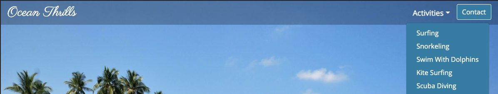
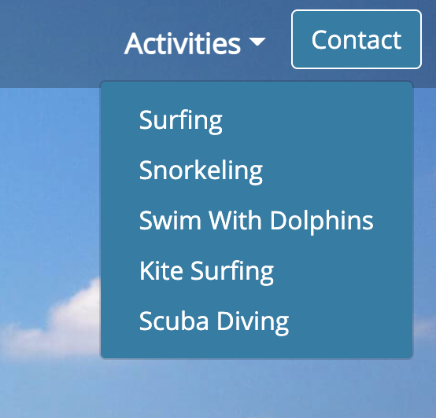
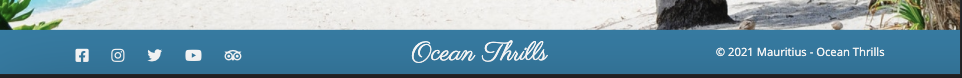
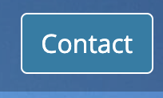

## 5. Testing
Various tools and validators were used to check that the site works well. Initially a few errors and suggestions resulted after running the URL through these tools and validators, but after correcting and implementing these errors and suggestions, all tests resulted positively.

### HTML Validation
The HTML of the website was validated using the [W3C Markup Validation Service](https://validator.w3.org/).

### CSS Validation
The CSS of the website was validated using the [W3C CSS Validation Service](https://jigsaw.w3.org/css-validator/).

### Link Validation
The links of the website were validated using the [W3C Link Checker](https://validator.w3.org/checklink). The Facebook and Twitter links were not checked due to robots exclusion rules, but I validated the link manually, and they work as expected. 

### Accessibility
The accessibility of the website was evaluated using the [WAVE Web Accessibility Evaluation Tool](https://wave.webaim.org/). The colour contrast of the initial blue shade background against the white text was reported as a fail, as a result the current shade of blue was chosen instead.

### JSHint
The JavaScript of the website was validated using [JSHint](https://jshint.com/).

### Performance
The overall performance of the website was evaluated using:-
- [Google Lighthouse](https://developers.google.com/web/tools/lighthouse/run)
- [Web Page Test](https://www.webpagetest.org/)

### Spelling and Grammer
The README.md file was run through [Online Spellcheck](https://www.online-spellcheck.com/) for any spelling and grammer mistakes.

### Other Testing
- The Subscription form will not submit until name, email and message fields are filled out. If a user tries to submit without these fields filled, an alert will apper.
- If the email field is filled incorrectly, an error of 'Please include an @ in the email address' is presented to the user.
- Tested all links within the site take the user to the appropriate pages.
- Website is responsive on  mobile, tablet and large screens.

### Testing User Stories
1. As a site visitor, I wish to navigate through the site easily so I can quickly find what I am looking for.

The navigation bar is easy to understand and always there for ease of navigation on the site. The logo at the top left of the page and in the footer also takes the user back to the home page at any given point.

On the _Activities_ page, there is an additional navigation button group. Each button displays the activity icon relating to that specific activity. Clicking each of these buttons also takes the user to the relevant activity page.

2. As a site visitor, I wish to view and interact with the site on all my devices.

[Google Chrome Developer Tools](https://developer.chrome.com/docs/devtools/) was used for testing of site responsiveness. The site works as expected. Friends and family tested the website on their phones, tablets and computer screens. Feedback was all positive.

3. As a site visitor, I wish to discover what sea and underwater activities I can take part in, in Mauritius.

The headline seen upon entering the site makes it clear that the user will discover some sea and underwater activities in Mauritius on this site.

Scrolling down the home page, the introduction explains that there are five sea and underwater activities represented on this site.

Scrolling further down the home page, these activities are listed as sections displaying a relevant background image, relevant icons, and buttons naming each activity (Surfing, Snorkeling, Swim With Dolphins, Kite Surfing, and Scuba Diving) in which the user can click in order to enter that activity.

On the navigation bar, the user can also click on the _Activities_ dropdown arrow and find the five activities represented in the site.

4. As a site visitor, I wish to know more about these activities in Mauritius.

Upon entering any of the activities from either the section buttons on the home page, or from the Activities dropdown menu on the navigation bar, the user will discover more about the specific activity:- 

The site moves to the activity page and displays the relevant 'clicked' activity with an image (on smaller screens), an introduction to the activity with regard to Maritius, and a map of Mauritius including markers for each location this activity is best experienced.

5. As a site visitor, I wish to find the best locations within Mauritius in order to take part in these water activities.

Each activity has a map of Mauritius which displays _Markers_ at various locations where users can experience that activity.

6. As a site visitor, I wish to know more about these locations, either through images, possible linked external websites, or just general information.

The map markers are clickable and each display an information window that include an image, a short desctiption and useful information about the location with regard to the activity. Some markers have website links to companies that offer the activity, shops, or schools specific to the activity.

7. As a site visitor, I wish to have visible access to social media, so I can follow and be a part of the community.

There are social media icons displayed on the footer throughout the site. These icons can be clicked and they take the user to the relevant page in a separate tab.

8. As a site visitor, I wish to be able to get in touch with the site owner and possibly receive discounted offers on the activities.

There is a __Contact__ button on the navigation bar throughout the site which takes the user to a Contact page. The user can then fill out the 'Get In Touch' form and in this way send a message to the site owner and/or 'check' the _checkbox_ in order to receive discounted offers on the activities listed on the site.

## 6. Project barriers and solutions

- Navbar menu items would not align to the right with Bootstrap _justify-content-end_ class, to fix this it had to be replaced with the _ml-auto_ class. Credit to [Stack Overflow](https://stackoverflow.com/questions/61174994/bootstrap-justify-content-end-not-working-as-expected).

- Had trouble forming a function to show one activity and hide the other activities. Through the help of Slack, this was overcome by using the CSS display: 'block' and display: 'none' properties.

- In order to get the above function to listen to the 'click' events, much research and assistance was necessary. Code Institute's Tutor support helped with this tremendously. 

- Markers seemed not to be displaying on all five maps. In reality the markers were displaying in Greenland instead of where was expected. The problem was that the latitude and longitude numbers were reversed. 